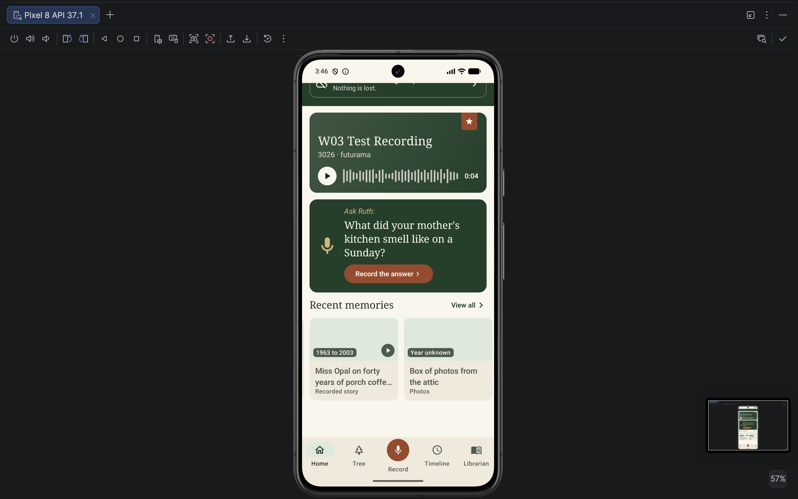
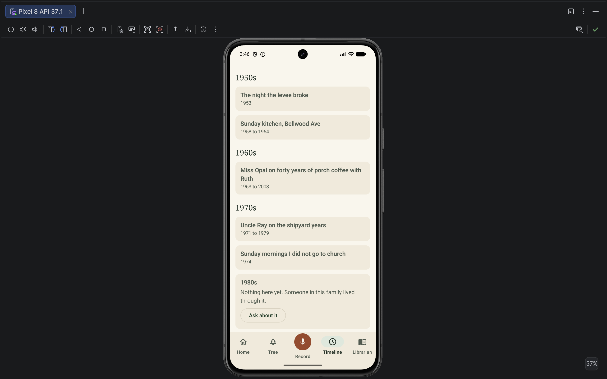
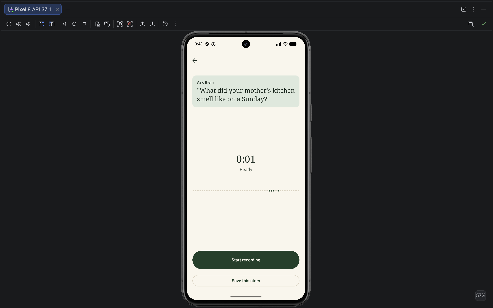

# W03 App QA Test Report

**Tester:** Shanik  
**Week:** W03  
**Branch tested:** AngelaPersonal  
**Platform:** Android Studio Emulator

## Testing Approach

I tested the app as a brand-new family member who had not previously used the application. The goal was to identify anything that was broken, confusing, missing, or unclear, while also documenting areas that worked correctly.

The testing covered the requested Home, Tree, Timeline, Record, and Librarian flows.

---

# QA Summary

## 🔴 Confirmed Bug / Functional Issue

### 1. Future year can be saved without validation

When creating a new story, the app accepts an obviously invalid future year (`3026`) without displaying a warning or validation message.

.png)
---

## 🟠 Potential Missing / Pending Functionality

### 2. Family member profiles cannot currently be opened
Tapping family members from both Home and Tree produces no response.

### 3. Audio playback is unavailable
Audio memories display their duration, but there is no Play button, audio player, or playback control.

### 4. 1980s "Ask about it" interaction does not respond
Neither the 1980s gap card nor its "Ask about it" button responds to taps.

### 5. Librarian does not appear to retrieve existing Timeline information
The Librarian reports that there is no information in the archive even when the requested year contains existing Timeline stories.

.png)
### 6. No observable difference between My Librarian and Our Family Librarian
Both modes returned the same response for all five questions tested.

### 7. Speaker attribution is not visible after saving
A speaker can be selected during story creation, but the saved story does not display who the speaker is.

### 8. Audio transcription may not be completing
Existing audio memories remain in the "Transcribing..." state. Further verification may be needed to determine whether this is expected for the current test data.

---

## 🟡 UX / Product Findings

### 9. Current user identity is unclear
There is no clearly identifiable current-user profile visible from Home.

### 10. "Start recording" does not clearly communicate that the current recording will be discarded
The action works, but its label could be clearer.

### 11. Librarian does not currently feel conversational
The response is presented more like a system/empty-state message than a conversational interaction.

### 12. "Add Family Member" appears to be pending functionality
The control is visible, but the functionality is not currently available. This was not classified as a bug because it may intentionally be planned for a later milestone.

---

# A. HOME

## A1. Family Member Profiles

**Screen:** Home - "Our Family" panel

**Action:**  
Tapped each family member's circle: Miss Opal, Ray, and Ruth.

**Expected:**  
Tapping a family member should open their profile and provide information about that person. The profile information should be prioritized, followed by their recent memories/stories and featured or highlighted memories.

**Actual:**  
Nothing happens when any of the family member circles are tapped.

**Result:**  
🟠 Potential missing navigation / unimplemented functionality.

**Note:**  
The same behavior was later observed in the Tree section, suggesting that individual family member profile navigation may not yet be implemented or connected to the UI.

---

## A2. Featured Story

**Screen:** Home - Featured story card

**Action:**  
Tapped the featured story card in different areas, first somewhere other than the Play button and then directly on the Play button.

**Expected:**  
Tapping the story should open the story details. The story details should provide access to the associated audio and, ideally, a text transcript for situations where listening to audio is inconvenient.

**Actual:**  
Both interactions navigate to the same second screen containing the story description, but no audio player or playback controls are present.

**Result:**  
🟠 Missing functionality / UX finding.

**Note:**  
The back button on the story screen works correctly.

---

## A3. Prompt Card - "Ask Ruth"

**Screen:** Home - Prompt card

**Action:**  
Selected "Record the answer" on the "Ask Ruth" prompt, recorded an answer, and continued to the "Keep this story" screen.

**Expected:**  
The app should clearly establish who the current user is and distinguish that person from the family member the question is directed toward.

**Actual:**  
The app asks "Whose voice is this?" and requires the speaker to be selected manually. The current flow effectively assumes that the person holding the device will record the answer on behalf of Ruth.

**Result:**  
🟡 UX / product design finding.

**Impact:**  
The user is not clearly identified, so it is unclear how "Ask Ruth" is supposed to work when someone other than Ruth is currently using the device.

---

## A4. Current User Identity

**Screen:** Home

**Observation:**  
There is no clearly identifiable current-user profile visible from the Home screen. The app displays family members, but it is not clear which person is currently using the app.

**Impact:**  
This becomes especially confusing during recording and the "Ask [name]" flow because the person using the device may not be the person being asked to provide the story.

**Suggestion:**  
Consider displaying the current user's profile clearly in the Home experience so that the user always knows who they are currently acting as.

---

## A5. Add Family Member

**Screen:** Home

**Observation:**  
An "Add Family Member" control is visible, but the functionality is not currently available.

**Result:**  
🟠 Pending functionality / implementation note.

**Note:**  
This was intentionally not classified as a bug because it may be planned for a later milestone.

---

# B. TREE

## B1. Family Member Profiles

**Screen:** Tree

**Action:**  
Tapped the available family members.

**Expected:**  
Tapping a person should open their profile.

**Actual:**  
Nothing happens when the family members are tapped.

**Result:**  
🟠 Potential missing navigation / unimplemented functionality.

**Note:**  
This is consistent with the same behavior observed in the Home "Our Family" panel.

---

## B2. Documents

**Screen:** Tree → Documents

**Action:**  
Opened Documents and tested the available family-member filters.

**Expected:**  
Documents should be organized clearly and users should be able to filter them by family member.

**Actual:**  
The Documents screen opens correctly and contains the description:

> "Records certificates and papers linked to the people they belong to."

The available filters include Everyone and the individual family members. Each filter can be selected and the selected state is visually clear.

**Result:**  
🟢 PASS.

---

## B3. Documents Empty State

**Screen:** Tree → Documents

**Action:**  
Tested the document filters for Everyone and individual family members.

**Expected:**  
If there are currently no documents, the app should clearly communicate this instead of appearing broken or empty without explanation.

**Actual:**  
The app displays:

> "No documents yet"

The message remains clear when switching between the different family-member filters.

**Result:**  
🟢 PASS.

**UX observation:**  
This is a good empty state because the user understands that there are simply no documents yet and does not feel like the screen failed to load.

---

# C. TIMELINE

## C1. View All → Timeline

**Screen:** Home → View All

**Action:**  
Tapped "View All."

**Expected:**  
The user should be taken to the complete collection of memories.

**Actual:**  
The app navigates directly to the Timeline section. The Timeline tab becomes highlighted in blue, clearly showing the user's current location in the app.

**Result:**  
🟢 PASS.

---

## C2. Timeline Organization

**Screen:** Timeline

**Action:**  
Reviewed memories across different decades.

**Expected:**  
Memories should be organized chronologically.

**Actual:**  
Years are displayed from oldest to newest, from top to bottom. Memories are grouped under their corresponding years.

**Result:**  
🟢 PASS.

---

## C3. Stories Across Different Decades

**Screen:** Timeline

**Action:**  
Opened stories from different periods.

**Expected:**  
Available memories should open correctly and display their information. The user should be able to return to Timeline easily.

**Actual:**  
The tested stories open correctly. Their dates correspond correctly to their position in the Timeline. The back button in the upper-left corner consistently returns to Timeline.

**Result:**  
🟢 PASS.

---

## C4. 1980s Gap Card

**Screen:** Timeline - 1980s gap card

**Action:**  
Tapped the 1980s gap card and its "Ask about it" button.

The card displays:

> "Nothing here yet. Someone in this family lived through it?"

**Expected:**  
The gap card should provide an appropriate interaction for asking about the missing period. "Ask about it" should initiate the intended question flow or provide some other clear action or feedback.

**Actual:**  
Nothing happens when the card is tapped. Nothing happens when "Ask about it" is tapped either. There is no navigation, dialog, or other feedback.

**Result:**  
🟠 Potential unimplemented interaction / missing functionality.

**Note:**  
Other Timeline memory cards respond to taps and open a screen containing the memory information. The 1980s gap card is the only "Ask about it" card currently available for testing, so it is unclear whether this functionality is intentionally pending or not functioning as expected.

---

## C5. Audio Memories

**Screen:** Timeline - memories containing audio

**Action:**  
Opened multiple memories containing audio.

**Expected:**  
An audio memory should provide a way to listen to the associated recording. If transcription is still processing, the audio should ideally remain accessible.

**Actual:**  
The memories display their title, date, related tags, and an audio duration such as `7:45`, but there is no Play button, audio player, or playback control.

**Result:**  
🟠 Missing functionality / UX finding.

**Note:**  
The same behavior was later observed with a newly recorded story created during this QA pass, so the absence of playback is not limited to the pre-existing Timeline stories.

---

## C6. Audio Transcription

**Screen:** Timeline - audio memories

**Observation:**  
Audio memories display a message indicating:

> "Transcribing this usually takes a couple minutes and finishes even if you leave"

However, the tested memories remain in the transcription state and the transcript does not appear.

**Result:**  
🟡 Potential issue requiring verification.

**Note:**  
This was not classified as a confirmed bug because it is unclear how long the existing test memories have been in this state and whether transcription is expected to be available for the current test data.

---

# D. RECORD

## D1. Recording Interface

**Screen:** Record

**Action:**  
Started a recording.

**Expected:**  
The recording state and available controls should be clear and intuitive.

**Actual:**  

- A suggested question appears when recording begins.
- A timer clearly indicates that recording is active.
- The recording button changes to reflect the active state.
- Pause works correctly.
- Resuming the recording works correctly.
- Stopping the recording works correctly.

**Result:**  
🟢 PASS.

**UX observation:**  
The recording interface is visually clear and intuitive. The recording state is easy to understand without requiring additional explanation.

---

## D2. Audio Waveform

**Screen:** Record

**Action:**  
Spoke while recording and observed the waveform.

**Expected:**  
If the waveform is intended to represent live audio input, it would be expected to react to the user's voice.

**Actual:**  
No visible waveform fluctuations were observed while speaking.

**Result:**  
🟡 Observation — not confirmed as a bug.

**Note:**  
Headphones were being used during testing, so it is possible that this is related to microphone input in the emulator. The recording itself was successfully created, so further testing would be needed before classifying this as a functional defect.

---

## D3. "Start Recording" After Stopping

**Screen:** Record → after stopping a recording

**Action:**  
Stopped the recording and viewed the available options.

**Expected:**  
The available actions should clearly communicate what will happen to the current recording.

**Actual:**  
The options are:

- "Start recording"
- "Save this story"

"Start recording" actually discards the current recording and begins a new recording. The current label does not make this consequence immediately obvious.

**Result:**  
🟡 UX clarity finding.

**Suggestion:**  
A label such as:

> "Discard & record again"

would communicate the action more clearly.

---

## D4. Save Story Metadata

**Screen:** Record → Save this story

**Action:**  
Tested the available story metadata fields, including title, speaker, date, location, tags, and librarian permissions.

**Result:**  
The save flow works and the resulting story is successfully created.

---

## D5. Invalid Future Year

**Screen:** Record → Save this story

**Action:**  
Entered `3026` in "When did this happen?" and saved the story.

**Expected:**  
The app should validate the entered year and provide feedback when an obviously invalid or unreasonable year is entered.

**Actual:**  
The app accepted `3026` without any warning and saved the story with 3026 as its year.

**Result:**  
🔴 BUG — missing date/year validation.

---

## D6. Custom Location

**Screen:** Record → Save this story

**Action:**  
Entered `Futurama` as the location.

**Expected:**  
The location field should allow users to enter a meaningful location.

**Actual:**  
The app accepted and saved the custom location correctly.

**Result:**  
🟢 PASS.

**UX suggestion:**  
The app could optionally suggest previously used family locations through autocomplete while still allowing users to enter custom or fictional locations. This would make frequently used family locations faster to enter without restricting creative or humorous locations.

---

## D7. Custom Tag

**Screen:** Record → Save this story

**Action:**  
Added the custom tag `testShanik`.

**Expected:**  
The custom tag should be saved with the story.

**Actual:**  
The `testShanik` tag appears correctly in the saved story.

**Result:**  
🟢 PASS.

---

## D8. Speaker Attribution

**Screen:** Record → Save this story

**Action:**  
Selected Ruth under "Whose voice is this?" before saving the story.

**Expected:**  
The selected speaker should be retained and represented somewhere in the saved story information.

**Actual:**  
Ruth can be selected during story creation, but no speaker attribution appears in the resulting story.

**Result:**  
🟠 Potential missing functionality / missing information in the UI.

**Note:**  
This also connects to the broader issue that the current user is not clearly identified within the Home experience.

---

## D9. Saved Story Appears on Home

**Screen:** Home → newly recorded story

**Action:**  
Saved the recording and returned to Home.

**Expected:**  
The newly created story should appear on Home.

**Actual:**  
The story appears correctly on Home and can be opened and interacted with.

**Result:**  
🟢 PASS.

---

## D10. Saved Audio Playback

**Screen:** Home → newly recorded story

**Action:**  
Opened the newly created story after saving it.

**Expected:**  
A saved story containing an audio recording should provide a way to play the recording.

**Actual:**  
The story displays an audio duration, confirming that an audio recording is associated with it, but no Play button, audio player, or playback controls are available.

**Result:**  
🟠 Missing functionality.

**Note:**  
This reproduces the same audio playback issue observed with existing Timeline memories.

---

# E. LIBRARIAN

## E1. Librarian Selector

**Screen:** Librarian

**Action:**  
Viewed and switched between "My Librarian" and "Our Family Librarian."

**Expected:**  
The two librarian modes should be clearly distinguishable and easy to switch between.

**Actual:**  

- "Our Family Librarian" is selected initially.
- Both options are clearly visible at the top.
- The selected state is visually clear.
- Switching between them is easy.
- There is no confusion about which mode is currently selected.

**Result:**  
🟢 PASS.

---

## E2. Librarian Questions

Five questions were tested in both "My Librarian" and "Our Family Librarian."

The questions covered:

1. A family member/name: "Who is Ruth?"
2. A year containing existing Timeline content: "What happened in 1953?"
3. A place appearing in the family archive.
4. Stories involving a family member.
5. A broader family question.

For all five questions, both librarian modes returned the same response:

> "Nothing in the archive speaks to that yet. That is a gap not an error. Consider recording it while you can."

**Result:**  
🟠 Potential missing functionality / implementation finding.

**Observation:**  
No observable difference between "My Librarian" and "Our Family Librarian" was found during the five questions tested.

---

## E3. Librarian and Existing Archive Content

**Screen:** Librarian

**Action:**  
Asked:

> "What happened in 1953?"

**Expected:**  
Because Timeline contains stories from 1953, the Librarian should ideally be able to retrieve or reference that existing information.

**Actual:**  
Both "My Librarian" and "Our Family Librarian" returned:

> "Nothing in the archive speaks to that yet. That is a gap not an error. Consider recording it while you can."

**Result:**  
🟠 Potential functional issue / missing archive integration.

**Note:**  
This may indicate that the Librarian is not yet connected to the existing archive or that the functionality is still being implemented. From a user's perspective, however, there is currently a discrepancy between information visible in Timeline and information available through the Librarian.

---

## E4. My Librarian vs. Our Family Librarian

**Observation:**  
Across all five questions, no difference was observable between the responses from My Librarian and Our Family Librarian.

**Result:**  
🟠 Potential missing functionality / implementation finding.

**Note:**  
This does not necessarily mean that either librarian is broken. However, the intended distinction between the two modes is currently not observable through their responses.

---

## E5. Librarian Interaction Design

**Observation:**  
The Librarian response is presented as a system/empty-state message rather than as a conventional conversational response.

**Result:**  
🟡 UX observation.

**Positive aspect:**  
The response clearly communicates that the archive does not contain enough information instead of inventing an answer. This is preferable to presenting fabricated family information.

**Potential improvement:**  
If the intended experience is a conversational family librarian, the current presentation does not strongly communicate a conversational interaction. If the Librarian is intentionally designed as a non-conversational archive tool, this may not require any change.

---

# F. CROSS-FLOW FINDINGS

## F1. Audio Playback

The absence of audio playback was observed in multiple parts of the application:

- Existing audio memories in Timeline.
- The Featured Story.
- A newly recorded story created during this QA pass.

In all cases, the story indicates that audio exists through its duration, but there is no Play button or playback control.

**Overall result:**  
🟠 This appears to be a broader missing audio functionality rather than an issue isolated to a single screen.

---

## F2. Family Member Profile Navigation

The same behavior was observed in two different locations:

- Home → Our Family
- Tree → family members

In both cases, tapping a family member produces no response.

**Overall result:**  
🟠 This may indicate that profile navigation has not yet been connected to the UI.

---

## F3. User Identity and Speaker Attribution

The current user is not clearly identified from Home.

This becomes especially noticeable in the recording flow:

1. A prompt says "Ask Ruth."
2. The person currently using the app records the answer.
3. The app asks "Whose voice is this?"
4. The user can select Ruth.
5. The resulting story does not visibly show the selected speaker.

This makes it difficult to understand who is actually answering and who owns the resulting recording.

**Overall result:**  
🟡 UX / product design finding.

---

# G. PRODUCT / UX SUGGESTIONS

These suggestions are separate from confirmed bugs and are based on the behavior observed during testing.

## G1. Asynchronous "Ask a Family Member" Flow

The current "Ask [name]" flow appears to assume that the person holding the phone will record the answer on behalf of the family member being asked.

A possible alternative would be:

1. The app suggests a question.
2. The user can edit the question before sending it.
3. The question is sent to the intended family member's profile.
4. That family member can answer later from their own device/profile.
5. The person answering chooses the privacy level for their response.
6. The response becomes available to the appropriate family members.
7. Responses could potentially generate follow-up questions.

This would separate the person asking the question from the person answering it and could make it easier to collect stories from family members who are not currently using the same device.

---

## G2. Clear Current-User Identity

Consider displaying the current user's profile clearly within the Home experience.

This could help clarify:

- who is currently using the app;
- who is creating a story;
- whose voice is being recorded;
- who is asking a family member a question.

---

## G3. Audio Playback

Audio memories currently communicate that audio exists by displaying a duration, but there is no way to play it.

Providing a visible Play button or audio player would make the existence of the recording actionable.

---

## G4. Location Suggestions

Consider suggesting previously used family locations as autocomplete options.

The field should still allow free-form text because family stories may contain:

- informal names;
- family-specific locations;
- fictional locations;
- humorous locations;
- places that are not recognized by a location database.

This would improve convenience without unnecessarily restricting the user.

---

# H. POSITIVE FINDINGS / WORKING WELL

The following areas worked consistently during testing:

- Home → View All navigation.
- Timeline chronological organization.
- Timeline story opening.
- Correct story dates relative to their Timeline position.
- Back navigation from story details.
- Documents navigation.
- Documents family-member filters.
- Clear selected state for Documents filters.
- Documents empty state.
- Recording start/stop controls.
- Recording timer.
- Pause and resume.
- Save story flow.
- Custom tags.
- Custom locations.
- Newly created story appearing on Home.
- Librarian mode selector.
- Clear selected state between My Librarian and Our Family Librarian.

The Documents empty state was particularly clear: displaying "No documents yet" makes it obvious that the collection is empty rather than making the user think the screen is broken.

The recording interface was also particularly intuitive. The active recording state, timer, pause/resume controls, and stop behavior were all easy to understand without additional explanation.

---

# I. OVERALL QA ASSESSMENT

The core navigation and several important UI flows are working well. Timeline organization, story navigation, Documents filtering, recording controls, story saving, and the Home display of newly created stories all behaved as expected during testing.

The main areas that appear to need further implementation, integration, or clarification are:

1. Family member profile navigation.
2. Audio playback.
3. The 1980s "Ask about it" interaction.
4. Librarian integration with existing archive content.
5. The distinction between My Librarian and Our Family Librarian.
6. Speaker attribution.
7. User identity within the family experience.
8. Date/year validation.
9. Audio transcription completion.

The most significant confirmed functional issue found during this QA pass was that the app accepts and saves an obviously invalid future year (`3026`) without validation.

Several other findings appear to represent functionality that may still be under development rather than confirmed defects. These have therefore been reported separately rather than being classified as bugs.